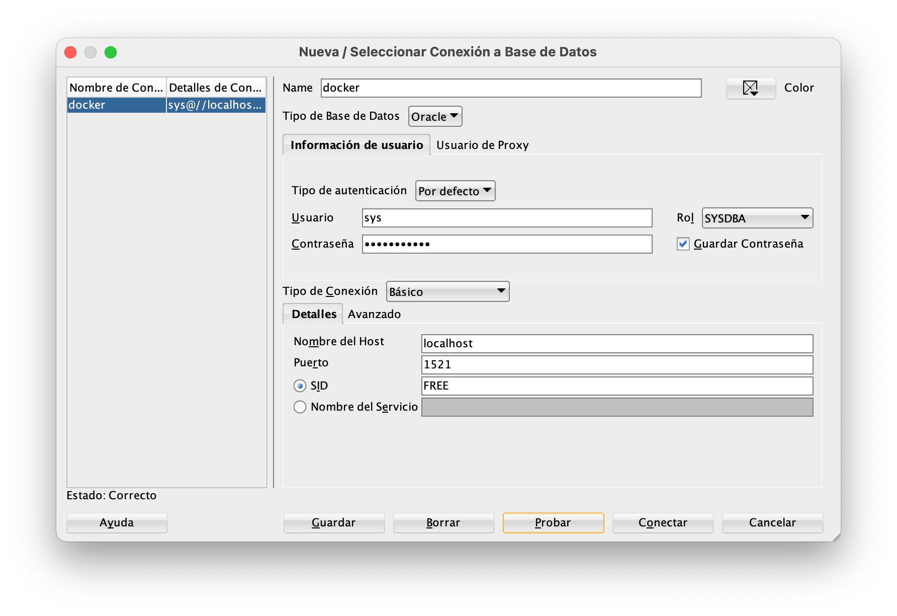

# Oracle Database con Docker

Instrucciones y fichero de configuración para arrancar una base de
datos [Oracle Database Free](https://www.oracle.com/es/database/free/) en local
mediante [Docker](https://www.docker.com).

## Prerrequisitos

1. Instalar Docker Desktop para [Windows y macOS](https://www.docker.com/products/docker-desktop/)
   o [Linux](https://docs.docker.com/desktop/linux/install/).

2. En Windows, instalar [Scoop](https://scoop.sh) usando PowerShell:

   ```powershell
   Set-ExecutionPolicy RemoteSigned -Scope CurrentUser
   [Net.ServicePointManager]::SecurityProtocol = [Net.SecurityProtocolType]::Tls12
   Invoke-Expression (New-Object System.Net.WebClient).DownloadString('https://get.scoop.sh')
   ```

   Y después instalar los comandos necesarios:

   ```powershell
   scoop install make
   ```

3. Instalar [Oracle SQL Developer](https://www.oracle.com/es/database/technologies/appdev/sql-developer.html) (requiere
   iniciar sesión con una cuenta de Oracle) o [JetBrains DataGrip](https://www.jetbrains.com/es-es/datagrip/) (requiere
   una suscripción).

4. Clonar este repositorio:

   ```shell
   git clone https://github.com/ijaureguialzo/oracle-docker.git
   ```

   > Si el comando anterior no funciona, habrá que [instalar Git](https://git-scm.com/downloads) en el sistema.

## Arrancar la base de datos

1. En un terminal, situarse en la carpeta que contiene el fichero `docker-compose.yml`.

   ```shell
   cd oracle-docker
   ```

2. Copiar el fichero `env-example` a `.env`:

   En macOS y Linux:

   ```shell
   cp env-example .env
   ```

   En Windows:

   ```shell
   copy env-example .env
   ```

   > :warning: Es recomendable cambiar las contraseñas por defecto.

   La versión de Oracle a utilizar se puede configurar en el fichero `.env` y se corresponde con las etiquetas
   disponibles [aquí](https://hub.docker.com/r/gvenzl/oracle-free).

3. Arrancar el servidor:

   ```shell
   make start
   ```

   > Si al arrancar da error porque el puerto está ocupado, se puede elegir otro editando el fichero `.env`.

4. Cuando haya arrancado (tarda unos minutos) aparecerá `(healthy)` en la salida del comando `make ps`.

   > Se puede ver el progreso de arranque mediante el comando `make logs`.

   > Para parar el servidor hay que utilizar el comando `make stop`.

## Datos de conexión

| Clave            | Valor                               |
|------------------|-------------------------------------|
| Usuario          | `SYS`                               |
| Contraseña       | La configurada en el fichero `.env` |
| Tipo de conexión | Básico                              |
| Rol              | `SYSDBA`                            |
| Host             | `localhost`                         |
| Puerto           | `1521`                              |
| SID              | `FREE`                              |

## Script para crear usuario

Para crear un usuario _normal_ con el que trabajar, el fichero [crear_usuario.sql](crear_usuario.sql) contiene un script
que se puede adaptar y ejecutar estando conectado como `SYS` al servidor.

## Conexión al servidor de base de datos

### Desde SQL Developer


